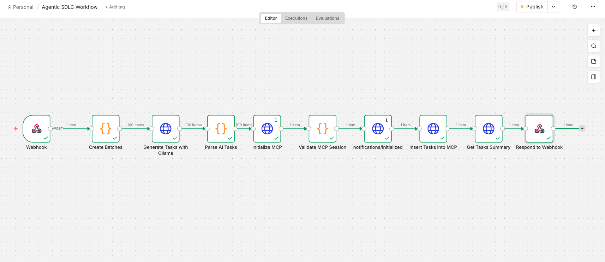
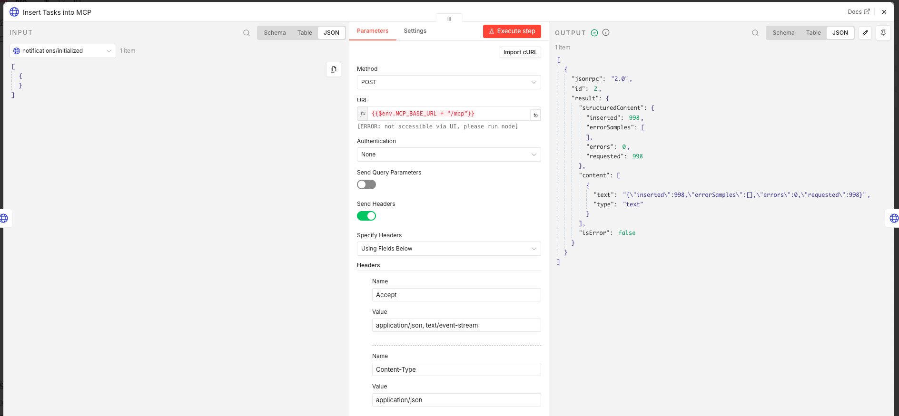
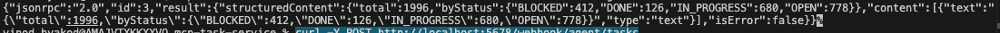
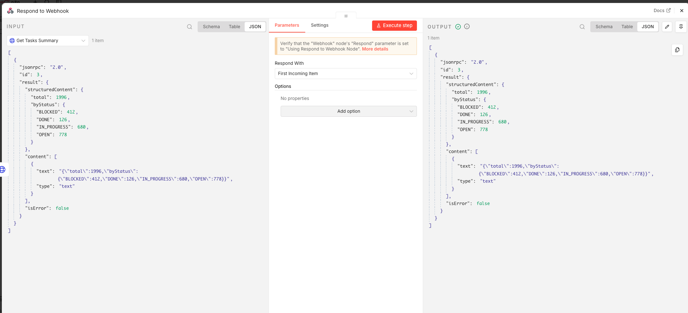
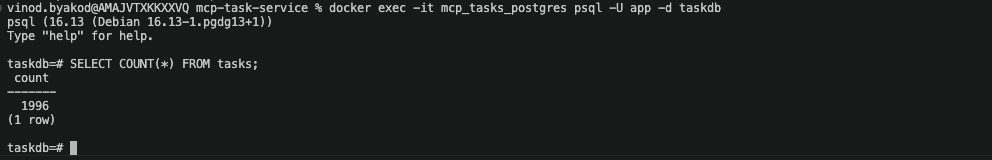

# agentic-sdlc-mcp-task-service

This repository implements the **Agentic SDLC Advanced Assignment** and contains the two required parts:

1. **Official MCP Protocol Task Service (Spring Boot + PostgreSQL)** for AI-powered task data injection
2. **Agentic workflow orchestration (n8n + local LLM via Ollama)** for an SDLC automation use case

This version exposes an **official MCP server endpoint** using **JSON-RPC 2.0 over Streamable HTTP**, while preserving the original task-management use case and assignment flow.

---

## 1. Assignment Goal

The objective of this project is to demonstrate an **AI-driven SDLC workflow** where an AI agent can:

- inspect the task schema
- generate realistic SDLC task records
- insert them through the MCP service
- validate the result in a PostgreSQL database
- return the final result through a webhook-driven workflow

In addition, the project includes **n8n workflows** that orchestrate the local LLM and the MCP service.

---

## 2. High-Level Architecture

### Overall Architecture

```text
Manual Trigger / Webhook
        ↓
       n8n
        ↓
  Ollama (Local LLM)
        ↓
 Parse AI Output
        ↓
Official MCP Server (Spring Boot)
        ↓
 PostgreSQL Database
```

### MCP Service Architecture

```text
AI Agent / n8n
      ⇅
Official MCP Server (Spring Boot)
      ⇅
 PostgreSQL
```

The MCP service is not part of the main business application flow.  
It acts as a **controlled AI-facing access layer** for schema inspection, data insertion, and summary retrieval.

### Agentic SDLC Workflow Architecture

```text
Webhook
  ↓
Create Batches
  ↓
Generate Tasks with Ollama
  ↓
Parse AI Tasks
  ↓
Initialize MCP
  ↓
Validate MCP Session
  ↓
notifications/initialized
  ↓
Insert Tasks into MCP
  ↓
Get Tasks Summary
  ↓
Respond to Webhook
```

---

## 3. Official MCP Protocol Implementation

This project exposes a single official MCP endpoint:

```text
POST   /mcp
GET    /mcp
DELETE /mcp
```

`/mcp` is used for:

- initialization
- lifecycle notifications
- tool discovery
- tool execution
- session termination

### Official MCP Pieces Included

- JSON-RPC 2.0 request / response envelopes
- MCP lifecycle support
  - `initialize`
  - `notifications/initialized`
  - `ping`
- MCP server tools support
  - `tools/list`
  - `tools/call`
- Streamable HTTP MCP endpoint at `/mcp`
- Session management via `Mcp-Session-Id`
- Protocol negotiation using `MCP-Protocol-Version`
- API key protection via `X-API-KEY`
- Rate limiting via Bucket4j

### Current Transport Behavior

This implementation is a **valid minimal Streamable HTTP MCP server**.

- `POST /mcp` handles JSON-RPC requests and notifications
- `GET /mcp` currently returns **405 Method Not Allowed** because outbound SSE streaming is not implemented in this minimal version
- `DELETE /mcp` closes a session when the client no longer needs it

This keeps the implementation compliant for a minimal server while staying small and reviewable.

---

## 4. Tools Exposed by the MCP Server

The MCP server exposes the following tools:

- `mcp_schema_tasks` — returns the task insert schema and example payload
- `mcp_tasks` — inserts task batches into PostgreSQL
- `mcp_tasks_summary` — returns task totals and counts by status

---

## 5. Project Structure

```text
agentic-sdlc-mcp-task-service/
├── db/
│   └── 001_init.sql
├── docker-compose.yml
├── Dockerfile
├── README.md
├── agent-garage/
│   └── AI_Core_Agent_Garage/
│       ├── .env
│       └── workflows/
├── mcp-task-service/
│   ├── pom.xml
│   ├── Dockerfile
│   ├── src/
│   │   ├── main/
│   │   │   ├── java/org/acn/mcptaskservice/
│   │   │   │   ├── controller/
│   │   │   │   ├── dto/
│   │   │   │   ├── exception/
│   │   │   │   ├── mcp/
│   │   │   │   ├── security/
│   │   │   │   └── service/
│   │   │   └── resources/application.yml
│   │   └── test/
│   └── target/
└── n8n exported workflow json files
```

---

## 6. Technology Stack

### Backend / MCP

- Java 21
- Spring Boot 3.3.5
- Maven
- Spring Web
- Spring JDBC
- Spring Validation
- Spring Security
- Spring Actuator
- PostgreSQL
- H2 for tests
- Bucket4j
- Docker / Docker Compose

### Agent / Workflow

- n8n
- Ollama
- llama3.2 / llama3.2:latest
- Webhook-based orchestration

---

## 7. Database Schema

The `tasks` table includes:

- `id`
- `title`
- `description`
- `status`
- `priority`
- `due_date`
- `created_at`

### Allowed Status Values

- OPEN
- IN_PROGRESS
- DONE
- BLOCKED

### Allowed Priority Values

- LOW
- MEDIUM
- HIGH

### Validation Rules

- `title` is required
- `title` max length is 140
- `description` max length is 5000
- `status` must be one of the allowed status values
- `priority` must be one of the allowed priority values
- `dueDate` must be in `YYYY-MM-DD` format
- maximum batch size per request is `5000`

---

## 8. Configuration

### Environment Variables for Spring Boot

Set the required environment variables before running the application:

```bash
export DB_URL=jdbc:postgresql://localhost:5432/taskdb
export DB_USER=app
export DB_PASSWORD=app
export MCP_API_KEY=testMe
export MCP_ALLOWED_ORIGINS=http://localhost,http://127.0.0.1
export SERVER_ADDRESS=0.0.0.0
```

### Environment Variables for n8n / Agent Workflow

Example values used in the working setup:

```bash
OLLAMA_BASE_URL=http://host.lima.internal:11434
MCP_BASE_URL=http://host.lima.internal:8081
MCP_API_KEY=testMe
OLLAMA_MODEL=llama3.2:latest
TOTAL_TASKS=1000
BATCH_SIZE=10
```

> If your environment uses `host.docker.internal` instead of `host.lima.internal`, update both URLs accordingly.

### application.yml Behavior

The app resolves:

- `spring.datasource.url` from `DB_URL`
- `spring.datasource.username` from `DB_USER`
- `spring.datasource.password` from `DB_PASSWORD`
- `app.api-key` from `MCP_API_KEY`
- `mcp.allowed-origins` from `MCP_ALLOWED_ORIGINS`
- `server.address` from `SERVER_ADDRESS`

---

## 9. How to Run the Project

### Prerequisites

Make sure you have installed:

- Java 21+
- Maven
- Docker / docker-compose
- Ollama
- n8n

### Step A — Start PostgreSQL

From the project root:

```bash
docker-compose up -d postgres
```

If your local Docker supports the new syntax, `docker compose` also works.

Verify the container is running:

```bash
docker ps
```

Expected postgres container for this project:

```text
mcp_tasks_postgres
```

### Step B — Run the MCP Service

Go to the Spring Boot project folder:

```bash
cd mcp-task-service
MCP_API_KEY=testMe mvn spring-boot:run -Dspring-boot.run.arguments=--server.port=8081
```

The MCP service will be available at:

```text
http://localhost:8081
```

> `8081` was used in the working setup because port `8080` was already occupied by Jira.

### Step C — Verify the MCP Service

```bash
curl http://localhost:8081/actuator/health
```

Expected:

```json
{"status":"UP"}
```

### Step D — Start Ollama

If Ollama is not already running:

```bash
ollama serve
```

Pull the model if needed:

```bash
ollama pull llama3.2
```

Verify:

```bash
curl http://localhost:11434/api/tags
```

### Step E — Start n8n

If using Docker:

```bash
docker-compose up -d n8n
```

Open:

```text
http://localhost:5678
```

---

## 10. MCP Lifecycle Example

All MCP POST requests should include:

- `X-API-KEY: <your-key>`
- `Accept: application/json, text/event-stream`
- `Content-Type: application/json`

After initialization, clients should also include:

- `Mcp-Session-Id: <session-id>`
- `MCP-Protocol-Version: 2025-06-18`

### 1) Initialize

```bash
curl -i -X POST http://localhost:8081/mcp \
  -H "X-API-KEY: testMe" \
  -H "Accept: application/json, text/event-stream" \
  -H "Content-Type: application/json" \
  -d '{
    "jsonrpc": "2.0",
    "id": 1,
    "method": "initialize",
    "params": {
      "protocolVersion": "2025-06-18",
      "capabilities": {},
      "clientInfo": {
        "name": "demo-client",
        "version": "1.0.0"
      }
    }
  }'
```

The response returns a JSON-RPC result and an `Mcp-Session-Id` header.

### 2) Send initialized notification

```bash
curl -i -X POST http://localhost:8081/mcp \
  -H "X-API-KEY: testMe" \
  -H "Accept: application/json, text/event-stream" \
  -H "Content-Type: application/json" \
  -H "Mcp-Session-Id: <SESSION_ID>" \
  -H "MCP-Protocol-Version: 2025-06-18" \
  -d '{
    "jsonrpc": "2.0",
    "method": "notifications/initialized"
  }'
```

Expected response: `202 Accepted`

### 3) List tools

```bash
curl -X POST http://localhost:8081/mcp \
  -H "X-API-KEY: testMe" \
  -H "Accept: application/json, text/event-stream" \
  -H "Content-Type: application/json" \
  -H "Mcp-Session-Id: <SESSION_ID>" \
  -H "MCP-Protocol-Version: 2025-06-18" \
  -d '{
    "jsonrpc": "2.0",
    "id": 2,
    "method": "tools/list",
    "params": {}
  }'
```

### 4) Read task schema via tool call

```bash
curl -X POST http://localhost:8081/mcp \
  -H "X-API-KEY: testMe" \
  -H "Accept: application/json, text/event-stream" \
  -H "Content-Type: application/json" \
  -H "Mcp-Session-Id: <SESSION_ID>" \
  -H "MCP-Protocol-Version: 2025-06-18" \
  -d '{
    "jsonrpc": "2.0",
    "id": 3,
    "method": "tools/call",
    "params": {
      "name": "mcp_schema_tasks",
      "arguments": {}
    }
  }'
```

### 5) Insert tasks via tool call

```bash
curl -X POST http://localhost:8081/mcp \
  -H "X-API-KEY: testMe" \
  -H "Accept: application/json, text/event-stream" \
  -H "Content-Type: application/json" \
  -H "Mcp-Session-Id: <SESSION_ID>" \
  -H "MCP-Protocol-Version: 2025-06-18" \
  -d '{
    "jsonrpc": "2.0",
    "id": 4,
    "method": "tools/call",
    "params": {
      "name": "mcp_tasks",
      "arguments": {
        "tasks": [
          {
            "title": "Prepare sprint planning notes",
            "description": "Collect stories and priorities for next sprint.",
            "status": "OPEN",
            "priority": "HIGH",
            "dueDate": "2026-04-10"
          },
          {
            "title": "Review test coverage report",
            "description": "Validate coverage before release.",
            "status": "IN_PROGRESS",
            "priority": "MEDIUM",
            "dueDate": "2026-04-11"
          }
        ]
      }
    }
  }'
```

### 6) Read summary

```bash
curl -X POST http://localhost:8081/mcp \
  -H "X-API-KEY: testMe" \
  -H "Accept: application/json, text/event-stream" \
  -H "Content-Type: application/json" \
  -H "Mcp-Session-Id: <SESSION_ID>" \
  -H "MCP-Protocol-Version: 2025-06-18" \
  -d '{
    "jsonrpc": "2.0",
    "id": 5,
    "method": "tools/call",
    "params": {
      "name": "mcp_tasks_summary",
      "arguments": {}
    }
  }'
```

### 7) End session

```bash
curl -i -X DELETE http://localhost:8081/mcp \
  -H "X-API-KEY: testMe" \
  -H "Mcp-Session-Id: <SESSION_ID>"
```

---

## 11. Tool Contracts

### `mcp_schema_tasks`

Input:

```json
{}
```

Output:

- schema metadata
- insert payload schema
- example payload

### `mcp_tasks`

Input:

```json
{
  "tasks": [
    {
      "title": "string",
      "description": "string",
      "status": "OPEN|IN_PROGRESS|DONE|BLOCKED",
      "priority": "LOW|MEDIUM|HIGH",
      "dueDate": "YYYY-MM-DD"
    }
  ]
}
```

Output shape in `structuredContent`:

```json
{
  "requested": 2,
  "inserted": 2,
  "errors": 0,
  "errorSamples": []
}
```

### `mcp_tasks_summary`

Input:

```json
{}
```

Output shape in `structuredContent`:

```json
{
  "total": 2,
  "byStatus": {
    "OPEN": 1,
    "IN_PROGRESS": 1
  }
}
```

---

## 12. Security

Protected MCP requests require:

- Header: `X-API-KEY`
- Value: your configured `MCP_API_KEY`

The health endpoint is intentionally accessible without an API key:

```bash
curl http://localhost:8081/actuator/health
```

Additional protections:

- session enforcement after initialization
- protocol version enforcement
- rate limiting via Bucket4j

---

## 13. Testing

Run the full test suite with:

```bash
cd mcp-task-service
mvn clean test
```

The test suite covers:

- initialize flow
- initialized notification requirement
- tools/list
- tools/call
- unknown session handling
- Accept header validation
- security smoke tests
- schema service tests
- task service tests
- exception handler tests

---

## 14. n8n Workflows

### 14.1 AI Task Generator (MCP)

This workflow uses a **manual trigger** and is the main proof-of-capability flow.

#### Flow

```text
Manual Trigger
  ↓
Create Batches
  ↓
Generate Tasks with Ollama
  ↓
Parse AI Tasks
  ↓
Initialize MCP
  ↓
Validate MCP Session
  ↓
notifications/initialized
  ↓
Insert Tasks into MCP
  ↓
Get Tasks Summary
```

#### Notes

- Uses `TOTAL_TASKS` and `BATCH_SIZE` from env
- Uses robust parsing for slightly malformed Ollama output
- Uses validated session id from `Validate MCP Session`
- Inserts all parsed tasks with:

```javascript
$items("Parse AI Tasks").map(item => item.json.tasks).flat()
```

### 14.2 Agentic SDLC Workflow

This workflow uses a **webhook trigger** and returns the final result through `Respond to Webhook`.

#### Flow

```text
Webhook
  ↓
Create Batches
  ↓
Generate Tasks with Ollama
  ↓
Parse AI Tasks
  ↓
Initialize MCP
  ↓
Validate MCP Session
  ↓
notifications/initialized
  ↓
Insert Tasks into MCP
  ↓
Get Tasks Summary
  ↓
Respond to Webhook
```

#### Webhook URL

Production:

```text
POST http://localhost:5678/webhook/agent/tasks
```

Test mode:

```text
POST http://localhost:5678/webhook-test/agent/tasks
```

> In the newer n8n UI, the workflow must be **Published** before the production webhook URL is registered.

---

## 15. Triggering the Agentic Workflow

### Production webhook

After publishing the workflow:

```bash
curl -X POST http://localhost:5678/webhook/agent/tasks
```

### Test webhook

When n8n shows **Waiting for you to call the Test URL**:

```bash
curl -X POST http://localhost:5678/webhook-test/agent/tasks
```

---

## 16. AI Generation Strategy

The local LLM was used to generate **realistic SDLC-related task records**, such as:

- sprint planning
- bug fixing
- feature implementation
- testing
- validation
- code review
- deployment preparation
- documentation

The workflow performs:

- AI generation
- output parsing
- validation
- insertion through MCP
- summary verification

This ensures the generated data is not inserted blindly.

---

## 17. Validation and Final Result

The final dataset was validated using the MCP summary tool and direct database verification.

### Example direct database verification

```bash
docker-compose exec postgres psql -U app -d taskdb -c "SELECT COUNT(*) FROM tasks;"
```

### Working run result

A successful working run inserted **998** tasks from one AI execution because **2 malformed / invalid AI records were filtered by the parser before insertion**.

Example successful MCP insert result:

```json
{
  "requested": 998,
  "inserted": 998,
  "errors": 0,
  "errorSamples": []
}
```

Example successful summary result from the same run:

```json
{
  "total": 1000,
  "byStatus": {
    "BLOCKED": 207,
    "DONE": 60,
    "IN_PROGRESS": 340,
    "OPEN": 393
  }
}
```

> The total can be cumulative if the database already contains tasks from previous runs.

---

## 18. Assignment Requirements Covered

### MCP Service

- MCP tool is running and accessible
- schema inspection works
- task insertion works
- summary retrieval works
- PostgreSQL integration works
- API key protection is implemented
- health check endpoint is available

### AI Agent Integration

- AI inspects schema
- AI generates realistic tasks
- AI inserts tasks through MCP
- AI validates success through summary

### Agentic Workflow

- local LLM setup completed
- n8n workflow created
- local LLM API call implemented
- traceable input/output via manual trigger and webhook
- SDLC-related use case implemented

---

## 19. Compliance Notes

This project is designed to be **officially MCP-compliant for a minimal Streamable HTTP server**.

What it intentionally does **not** implement yet:

- SSE streaming responses on `GET /mcp`
- server-initiated notifications / requests
- prompts
- resources
- OAuth authorization flow

Those are useful extensions, but they are not required to make this a valid minimal MCP server with tools support.

---

## 20. Sample Agent Prompt

The following style of prompt was used by the AI workflow:

> Generate realistic SDLC task records with valid title, description, status, priority, and dueDate fields. Insert them through MCP and then validate the result using the summary tool.

The agent workflow performed the following steps:

1. Generate realistic SDLC task data
2. Parse and validate the output
3. Insert tasks through MCP
4. Validate results through summary

This confirms end-to-end AI-driven task generation and database insertion.

---

## 21. Screenshots


- MCP service running 

- n8n AI Task Generator workflow
.png)
- n8n Agentic SDLC Workflow

- successful initialize / session flow

- successful insert response

- successful summary response
 Summary.png)
- webhook response


- PostgreSQL verification



---

## 22. Deliverable Summary

This repository now provides:

- a single MCP endpoint at `/mcp`
- official JSON-RPC 2.0 request format
- lifecycle management
- protocol version negotiation
- session management
- tool discovery and tool execution
- PostgreSQL-backed task insertion and summary validation
- n8n workflow integration with local LLM

---

## 23. Author

**Vinod Byakod**
