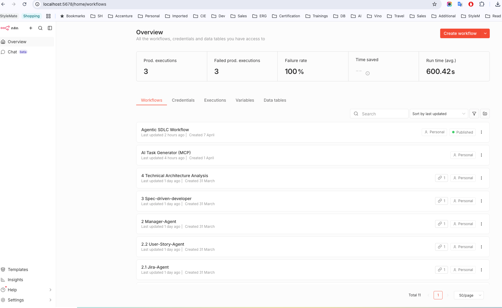
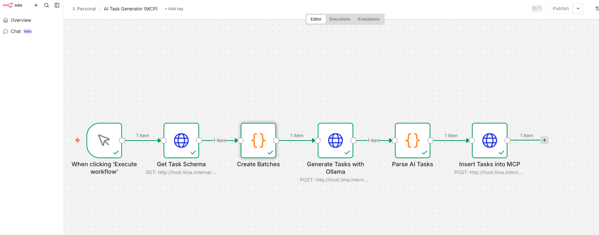
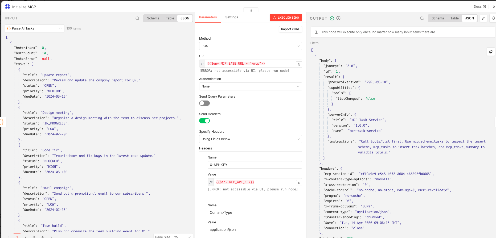

# Agentic SDLC Advanced Assignment

This repository implements the **Agentic SDLC Advanced Assignment** and contains the two required parts:

1. **Minimal MCP-style Task Service (Spring Boot + PostgreSQL)** for AI-powered task data injection  
2. **AgentGarage Workflow (n8n + Local LLM via Ollama)** for an SDLC automation use case

---

# 1. Assignment Goal

The objective of this project is to demonstrate an **AI-driven SDLC workflow** where:

- an **AI agent** can inspect a task schema
- generate realistic task records
- insert them through an MCP-style service
- validate the result in a PostgreSQL database

In addition, the project includes an **AgentGarage / n8n workflow** that orchestrates the local LLM and the MCP service.

---

# 2. High-Level Architecture

## Overall Architecture

```text
Webhook / Agent Trigger
        ↓
      n8n
        ↓
   Ollama (LLM)
        ↓
 Parse AI Output
        ↓
 Spring Boot MCP Service
        ↓
   PostgreSQL Database
```

## MCP Service Architecture

```text
AI Agent
   ⇅
Custom MCP-style Server (Spring Boot)
   ⇅
PostgreSQL
```

The MCP service is not part of the main business application flow.  
It acts as a **controlled AI-facing access layer** for schema inspection, data insertion, and summary retrieval.

## AgentGarage Workflow Architecture

```text
Webhook
  ↓
Create Batches
  ↓
Generate Tasks with Ollama
  ↓
Parse AI Tasks
  ↓
Insert Tasks into MCP
  ↓
Get MCP Summary
  ↓
Respond to Webhook
```

---

# 3. Project Structure

```text
agentic-sdlc-mcp-task-service/
├── mcp-task-service/              # Spring Boot MCP application
│   ├── src/
│   ├── pom.xml
│   └── ...
├── db/
│   └── 001_init.sql              # PostgreSQL table creation
├── docker-compose.yml            # Runs PostgreSQL and app service
├── agent-garage/
│   └── AI_Core_Agent_Garage/     # AgentGarage / n8n setup
├── generate_tasks.py             # Optional helper script used during testing
└── README.md
```

---

# 4. Technology Stack

## Backend / MCP

- Java 21
- Spring Boot
- Maven
- PostgreSQL
- Docker / docker-compose
- Spring Security
- Spring Actuator

## Agent / Workflow

- n8n
- Ollama
- llama3.2
- Local webhook-based orchestration

---

# 5. MCP Task Service

## Objective

Build a minimal MCP-style service that allows an AI agent to:

- inspect the task schema
- insert task records
- retrieve summary statistics

## MCP Endpoints

| Endpoint | Method | Description |
|----------|--------|-------------|
| `/mcp/help` | GET | Returns available MCP tools/endpoints |
| `/mcp/schema/tasks` | GET | Returns simplified task schema |
| `/mcp/tasks` | POST | Inserts task records |
| `/mcp/tasks/summary` | GET | Returns task statistics by status |
| `/actuator/health` | GET | Returns application health status |

## MCP Endpoint Usage

### Help

```bash
curl -H "X-API-KEY: your-secret-key"   http://localhost:8080/mcp/help
```

### Schema

```bash
curl -H "X-API-KEY: your-secret-key"   http://localhost:8080/mcp/schema/tasks
```

### Insert Tasks

```bash
curl -X POST http://localhost:8080/mcp/tasks   -H "Content-Type: application/json"   -H "X-API-KEY: your-secret-key"   -d '[{
    "title":"Example Task",
    "description":"Test task",
    "status":"OPEN",
    "priority":"MEDIUM",
    "dueDate":"2026-01-01"
  }]'
```

### Summary

```bash
curl -H "X-API-KEY: your-secret-key"   http://localhost:8080/mcp/tasks/summary
```

### Health Check

```bash
curl http://localhost:8080/actuator/health
```

## Security

Protected endpoints require:

- Header: `X-API-KEY`
- Value: your configured `MCP_API_KEY`

Example:

```bash
curl -H "X-API-KEY: your-secret-key"   http://localhost:8080/mcp/tasks/summary
```

The health endpoint is intentionally accessible without an API key:

```bash
curl http://localhost:8080/actuator/health
```

---

# 6. Database Schema

The `tasks` table includes:

- `id`
- `title`
- `description`
- `status`
- `priority`
- `due_date`
- `created_at`

## Allowed Status Values

- OPEN
- IN_PROGRESS
- DONE
- BLOCKED

## Allowed Priority Values

- LOW
- MEDIUM
- HIGH

## Validation Rules

- `title` is required
- `title` max length is 140
- `description` max length is 5000
- `status` must be one of the allowed status values
- `priority` must be one of the allowed priority values
- `dueDate` must be in `YYYY-MM-DD` format
- Maximum batch size per request is `5000`

---

# 7. How to Run the Project

## Prerequisites

Make sure you have installed:

- Java 21+
- Maven
- Docker / docker-compose
- Ollama
- n8n

## Environment Variables

Set the required environment variables before running the application:

```bash
export DB_URL=jdbc:postgresql://localhost:5432/taskdb
export DB_USER=app
export DB_PASSWORD=your-password
export MCP_API_KEY=your-secret-key (app.api-key is resolved from MCP_API_KEY in application.yml)
```

## Step A — Start PostgreSQL

From the project root:

```bash
docker-compose up -d
```

Verify the container is running:

```bash
docker ps
```

## Step B — Run the MCP Service

Go to the Spring Boot project folder:

```bash
cd mcp-task-service
mvn spring-boot:run
```

The MCP service will be available at:

```text
http://localhost:8080
```

## Step C — Verify MCP Service

Run:

```bash
curl http://localhost:8080/actuator/health

curl -H "X-API-KEY: your-secret-key"   http://localhost:8080/mcp/help

curl -H "X-API-KEY: your-secret-key"   http://localhost:8080/mcp/schema/tasks

curl -H "X-API-KEY: your-secret-key"   http://localhost:8080/mcp/tasks/summary
```

## Step D — Start Ollama

If Ollama is not already running:

```bash
ollama serve
```

Pull the model if needed:

```bash
ollama pull llama3.2
```

Verify:

```bash
curl http://localhost:11434/api/tags
```

## Step E — Start n8n

If installed locally:

```bash
n8n
```

Open:

```text
http://localhost:5678
```

---

# 8. n8n Agent Workflow

## Purpose

The n8n workflow acts as the **AI agent orchestrator**.  
It takes a webhook request, asks the local LLM to generate tasks, parses them, inserts them through MCP, and returns the final task summary.

## Workflow Steps

1. **Webhook** — receives request input  
2. **Create Batches** — creates batch instructions (`batchCount`, `batchSize`)  
3. **Generate Tasks with Ollama** — asks the local LLM for realistic tasks  
4. **Parse AI Tasks** — extracts valid JSON tasks from LLM output  
5. **Insert Tasks into MCP** — calls `/mcp/tasks`  
6. **Get MCP Summary** — calls `/mcp/tasks/summary`  
7. **Respond to Webhook** — returns final result

---

# 9. Agent Execution

Once the webhook workflow is active, trigger it with:

```bash
curl -X POST http://localhost:5678/webhook/agent/tasks   -H "Content-Type: application/json"   -d '{"batchCount":100,"batchSize":10}'
```

---

# 10. AI Generation Strategy

The local LLM was used to generate **realistic SDLC-related task records**, such as:

- sprint planning
- bug fixing
- feature implementation
- testing
- validation
- code review
- deployment preparation
- documentation

The workflow performs:

- AI generation
- output parsing
- validation
- insertion through MCP
- summary verification

This ensures the generated data is not inserted blindly.

---

# 11. Validation and Final Result

The final dataset was validated using:

```bash
curl -H "X-API-KEY: your-secret-key"   http://localhost:8080/mcp/tasks/summary
```

and direct database verification:

```bash
docker-compose exec postgres psql -U app -d taskdb -c "SELECT COUNT(*) FROM tasks;"
```

## Final Result

- Total tasks created: **1000**
- Data stored successfully in PostgreSQL
- Inserted through MCP-style API
- Generated through AI-assisted workflow

## Final Summary Output

```json
{
  "specVersion": "2025-06-18",
  "tool": "mcp-tasks-summary",
  "total": 1000,
  "byStatus": {
    "OPEN": 344,
    "IN_PROGRESS": 236,
    "DONE": 199,
    "BLOCKED": 221
  }
}
```

---

# 12. Assignment Requirements Covered

## MCP Service

- MCP tool is running and accessible
- Schema inspection works
- Task insertion works
- Summary endpoint works
- PostgreSQL integration works
- API key protection is implemented
- Health check endpoint is available

## AI Agent Integration

- AI inspects the schema
- AI generates realistic tasks
- AI inserts tasks through MCP
- AI validates success through summary endpoint

## AgentGarage

- Local LLM setup completed
- n8n workflow created
- At least one API request to local LLM
- Traceable input/output via webhook
- SDLC-related use case implemented

---

# 13. Tests

Run the full test suite with:

```bash
mvn clean test
```

The test suite covers:

- service logic
- schema generation
- exception handling
- controller behavior
- security smoke tests

---

# 14. Notes

- During testing, smaller batches were used first to stabilize the local LLM output.
- The final 1000-task target was reached through repeated AI-driven batch execution.
- Some parser normalization was added to handle imperfect LLM JSON formatting.
- This implementation is **MCP-style / MCP-inspired**, not a full JSON-RPC MCP protocol server.

---

# 15. Sample Agent Prompt

The following prompt was used by the AI agent:

> Please inspect the task schema at `/mcp/schema/tasks`. Then generate and insert 1000 diverse tasks with random statuses, titles, and due dates using the `/mcp/tasks` endpoint.

The agent workflow performed the following steps:

1. Inspect schema using `/mcp/schema/tasks`
2. Generate realistic SDLC task data
3. Insert tasks using `/mcp/tasks`
4. Validate results using `/mcp/tasks/summary`

This confirms end-to-end AI-driven task generation and database insertion.

---

# 16. Screenshots

## 16.1 Agentic SDLC Workflow



## 16.2 AI Task Generator (MCP)



## 16.3 Tasks Summary

```bash
curl -H "X-API-KEY: your-secret-key"   http://localhost:8080/mcp/tasks/summary
```

```json
{
  "total": 1000,
  "byStatus": {
    "OPEN": 344,
    "IN_PROGRESS": 236,
    "DONE": 199,
    "BLOCKED": 221
  }
}
```



---

# 17. Author

**Vinod Byakod**
